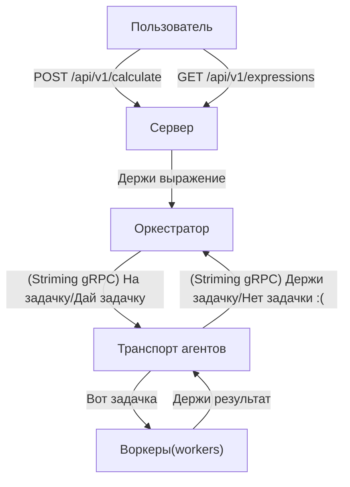

# Calculating
Сервис подсчёта арифметических выражений

# Содержание
1. [Перед началом работы](#перед-началом-работы-)
2. [Запуск](#запуск)
   - [Docker Compose](#docker-compose)
3.  [Глобальные переменные](#глобальные-переменные)
    - [Логирование](#логирование)
    - [Задержка](#задержка)
    - [Агент](#агент)
    - [СУБД](#субд)
4. [Особенности проекта](#особенности-проекта)
5. [Как работает проект?(граф)](#как-работает-проект)
6. [Примеры использования (curl'ы и не только)](#примеры-использования-)
   - [/api/v1/calculate](#apiv1calculate)
     - [Общий пример запроса/ответа](#общий-пример-запросаответа)
     - [curl'ы](#примеры-curlов)
   - [/api/v1/expressions/{id}](#apiv1expressionsid)
     - [Общий пример запроса/ответа](#общий-пример-запросаответа-1)
     - [curl'ы](#примеры-curlов-1)
   - [/api/v1/expressions](#apiv1expressions)
       - [Общий пример запроса/ответа](#общий-пример-запросаответа-2)
       - [curl'ы](#примеры-curlов-2)

# Перед началом работы 
Требуется Go версии 1.23.1 или выше

Или

Docker версии 27.5.1 или выше

# Запуск

Скопируйте проект и перейдите в директорию с ним
```shell
git clone https://github.com/Cool-Andrey/Calculating && cd Calculating
```
## Docker Compose

Для сборки введите 

```shell
docker compose build 
```
Для запуска
```shell
docker compose up --abort-on-container-failure
```
Для остановки
```shell
docker compose down
```

Либо же можно и для сборки, и для запуска использовать команду
```shell
docker compose up --build --abort-on-container-failure
```
Рекомендую не убирать флаг --abort-on-container-failure. Если один из контейнеров упадёт, то всё остальные тоже упадут за ним. Сделано это в первую очередь для тестов - не прошли тесты, вернули код 1, контейнеры упали. Если что-то не так - опишите в issues вашу проблему, и попробуйте убрать флаг.

# Глобальные переменные
Если вы укажете не то значение, которое здесь описано, то приложение будет падать!!! 
## Логирование
Эти переменные дублируются и для сервера, и для агента. Т.е. указывать их надо при запуске каждого.

`MODE_CONSOLE`: режим отображения логов в консоли. Принимает значения `Dev` - более читабельные логи, и `Prod` - вывод в формате json(регистр может быть любым). По умолчанию `Dev`

`MODE_FILE`: режим записи логов в файл. Принимает такие же значения, что и `MODE_CONSOLE`. По умолчанию `Prod`

`CLEAN_FILE`: `false` - файл логов, если не был удалён, не очищать и просто добавлять в конец файла логи. `true` - файл логов, если не был удалён, очищать и заново записывать уже новые логи. По умолчанию `false`

`WRITE_FILE`: определяет, надо ли записывать файл логов. Принимает одно значение - `false` - не записывать. В остальных случаях файл записывается. Если у вас ошибка `write error: write log/server.log: bad file descriptor`, попробуйте поставить `false`. 

## Задержка
`TIME_ADDITION_MS`: время выполнения сложения(задержка при сложении). В миллисекундах. Принимает любое неотрицательное целое значение. По умолчанию `1000`

`TIME_SUBTRACTION_MS`: время выполнения вычитания(задержка при вычитании). В миллисекундах. Принимает любое неотрицательное целое значение. По умолчанию `1000`

`TIME_MULTIPLICATIONS_MS`: время выполнения умножения(задержка при умножении). В миллисекундах. Принимает любое неотрицательное целое значение. По умолчанию `1000`

`TIME_DIVISIONS_MS`: время выполнения деления(задержка при делении). В миллисекундах. Принимает любое неотрицательное целое значение. По умолчанию `1000`

## Агент

`COMPUTING_POWER`: количество воркеров - горутин, которые выполняют элементарные арифметические операции(+,-,*,/). Принимает любое натуральное значение. По умолчанию `2`

`PING`: раз во сколько миллисекунд будет опрашиваться оркестратор. Принимает любое неотрицательное целое значение. По умолчанию `1000`

`GRPC_HOST`: Думаю, объяснять зачем он не надо. Стандартное значение: `0.0.0.0`
`GRPC_PORT`: Стандартное `50051`

## СУБД


`DATABASE_URL`: Прямой путь до Postgres. 

`DATABASE_HOST`: Хост Postgres. По умолчанию `localhost`

`DATABASE_PORT`: Порт Postgres. По умолчанию `5432`

`DATABASE_USER`: Пользователь(логин) Postgres. Обязателен, либо нужен `DATABASE_URL`

`DATABASE_PASSWORD`: Пароль Postgres. Обязателен, либо нужен `DATABASE_URL`

`DATABASE_NAME`: Имя БД. Обязательно, либо нужен `DATABASE_URL`

# Особенности проекта

Используется только Postgres.

Ошибки, связанные с форматированием json'а, выводятся сразу при отправке выражения как ответ(примеры ниже). Все ошибки, связанные с корректностью выражения, видны только в результате выражения! Т. е. увидете ошибку вы только запросив результат вычисления выражения.
# Как работает проект?
Работает проект на RPN и AST.


Здесь хорошо видно, что [оркестратор](internal/service/orchestrator) - это программа, делающая задачи(tasks). У меня он реализован как что-то по типу сервиса.(Назвать это сервисом я не решусь, слишком убого `:(` )

[Транспорт агентов](internal/agent/transport/get.go) - программа, которая запрашивает задачу у сервера и отправляет результат выполнения задачи.[endpoint'ы](#internaltask) или [postman](examples/postman/Calculatung%20API.postman_collection.json)

# Примеры использования 

Тут много примеров, есть файл [postman](examples/postman/Calculatung%20API.postman_collection.json) с более красивым оформлением, ежели это. Для лучшего понимания ознакомьтесь с обоими вариантами - и с README, и с postman коллекцией.

## /api/v1/calculate
Принимает выражение на подсчёт.
### Общий пример запроса/ответа
Внимание! Принимается только POST запрос!

Запрос
```http request
POST http://127.0.0.1:8080/api/v1/calculate
Content-Type: application/json
{
    "expression" : "выражение"
}
```

Код ответа: `201`

Тело ответа
```json
{"id":ваш_id}
```

Если проблема в json

Код ответа `422`

Тело ответа
```json
{"error": "текст ошибки"}
```

Если неправильный метод 

Код ответа `405`

Тело ответа
```
Method Not Allowed
```

### Примеры curl'ов
Внимание! Показаны ответы НА ЭТОТ ЖЕ запрос, а не на GET. 

Правильное выражение
```shell
curl --location 'http://127.0.0.1:8080/api/v1/calculate' \
--header 'Content-Type: application/json' \
--data '{
    "expression" : "2+5/11+65897*989+6582+999*222-88245/2.4"
}'
```
Код ответа `201`.

Тело ответа
```json
{"id":ваш_id}
```

Некорректное выражение
```shell
curl --location 'http://127.0.0.1:8080/api/v1/calculate' \
--header 'Content-Type: application/json' \
--data '{
    "expression": "2+2+"
}'
```
Код ответа `201`.

Тело ответа
```json
{"id":ваш_id}
```

Некорректный json
```shell
curl --location 'http://127.0.0.1:8080/api/v1/calculate' \
--header 'Content-Type: application/json' \
--data '{
    "expression": "2+2"
'
```
Код ответа `422`

Тело ответа
```json
{"error":"Товарищ пользователь! Проверьте правильность написания json'а"}
```

Неправильный метод
```shell
curl --location 'http://127.0.0.1:8080/api/v1/calculate'
```

Код ответа `405`

Тело ответа
```
Method Not Allowed
```

Пустой запрос
```shell
curl --location '' \
--header 'Content-Type: application/json' \
--data ''
```

Код ответа `422`

Тело ответа 
```json
{"error":"Пустой запрос!"}
```

Пустой json

```shell
curl --location 'http://127.0.0.1:8080/api/v1/calculate' \
--header 'Content-Type: application/json' \
--data '{}'
```
Код ответа `201`.

Тело ответа
```json
{"id":ваш_id}
```

Пустое выражение
```shell
curl --location 'http://127.0.0.1:8080/api/v1/calculate' \
--header 'Content-Type: application/json' \
--data '{
    "expression" : ""
}'
```
Код ответа `201`.

Тело ответа
```json
{"id":id}
```

## /api/v1/expressions/{id}
Ищёт выражение по id
### Общий пример запроса/ответа
Внимание! Принимается только GET запрос!

Запрос
```http request
GET /api/v1/expressions/{id} HTTP/1.1
Host: 127.0.0.1:8080
```
Код ответа `200`

Тело ответа
```json
{"expression":{"id":id,"status":"","result":""}}
```

Если не нашёл выражение код ответа `404` без тела. Произошла внутренняя ошибка - код ответа `500`, опять таки без тела. Если некорректный тип запроса - `405` и текст ```Method Not Allowed```

### Примеры curl'ов
Везде id выражения - 1

Выражение корректно и записано

```shell
curl --location 'http://127.0.0.1:8080/api/v1/expressions/1'
```
Код ответа `200`

Тело ответа, если идёт подсчёт
```json
{"expression":{"id":1,"status":"Подсчёт","result":""}}
```
Если выражение полностью посчиталось
```json
{"expression":{"id":1,"status":"Выполнено","result":"65363726.70"}}
```

Выражение некорректно

```shell
curl --location 'http://127.0.0.1:8080/api/v1/expressions/1'
```

```json
{"expression":{"id":1,"status":"Выполнено","result":"Одна из ошибок записи/вычисления выражения. Подробнее в файле"}} 
``` 
[Ошибки](pkg/calc/errors.go)

## /api/v1/expressions
Возвращает массив из json'ов, аналогичных api/v1/expressions/{id}

### Общий пример запроса/ответа
Только GET запросы

```http request
GET /api/v1/expressions HTTP/1.1
Host: 127.0.0.1:8080
```

Код ответа `200`
```json
{"expressions":[{"id":1,"status":"Выполнено","result":"65363726.70"},{"id":2,"status":"Выполнено","result":"Товарищ пользователь! Проверьте количество операндов(+,-,/,*), их порядок и проверьте что нет буков"}]}
```
Либо `500`, если внутренняя ошибка

### Примеры curl'ов

```shell
curl --location 'http://127.0.0.1:8080/api/v1/expressions'
```

Код ответа `200`
```json
{"expressions":[{"id":1,"status":"Выполнено","result":"65363726.70"},{"id":2,"status":"Выполнено","result":"Товарищ пользователь! Проверьте количество операндов(+,-,/,*), их порядок и проверьте что нет буков"}]}
```

# Контакты
Если вы заметили баг/ошибку - напишите мне, пожалуйста(хоть в issues)! Если хотите высказать своё гневное фи за проект, тоже пишите(только без оскорблений и переходов на личности). Буду рад если вы напишите код ревью, хоть убогий, хочется услышать чужое мнение.

Тг https://t.me/maincraftmylive2 или ник `@maincraftmylive2`

Почта `sbs469@mail.ru`